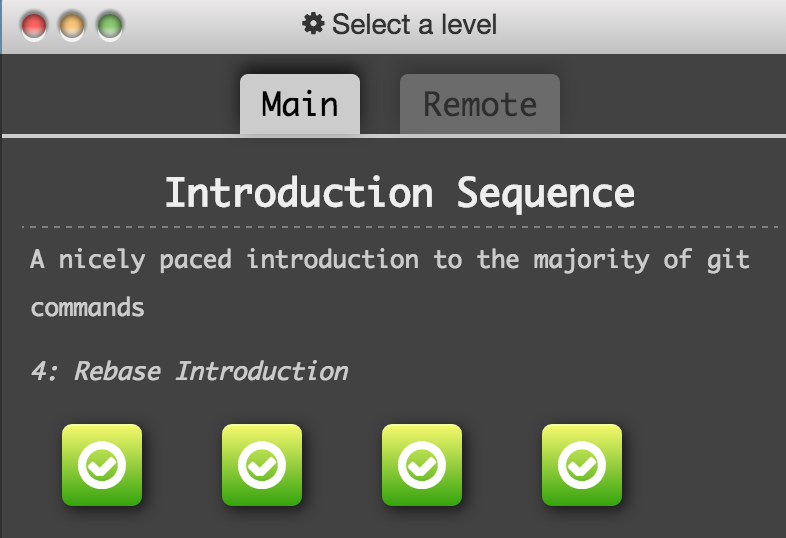
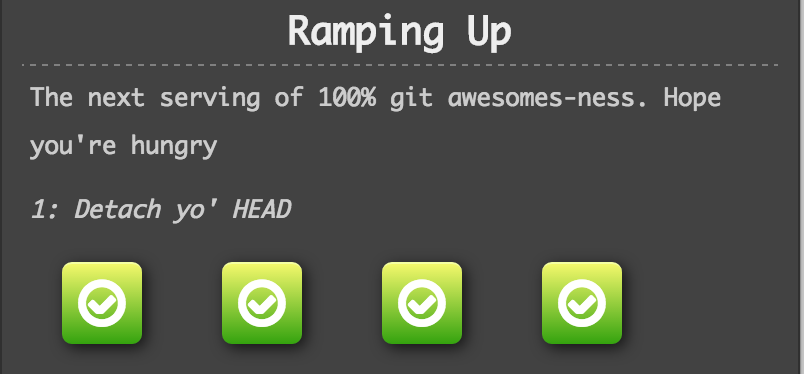
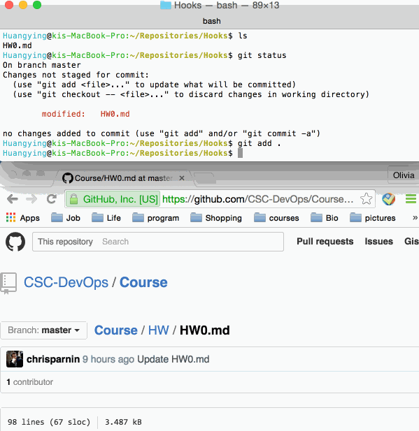

##Puzzle solution:

###-------Introduction sequence-------
#####Level1:    
git commit -m 'C2'    
git commit -m 'C3'
#####Level2:
git branch bugFix    
git checkout bugFix
#####Level3:
git branch bugFix    
git checkout bugFix   
git commit -m 'C2'   
git checkout master    
git commit -m 'C3'   
git merge bugFix
#####Level4:
git checkout -b bugFix   
git commit -m 'C2' 
git checkout master   
git commit -m 'C3'   
git checkout bugFix   
git rebase master

####Screenshot:

###-------Ramp up-------
#####Level1:    
git checkout C4
#####Level2:
git checkout bugFix^   
or   
git checkout C3
#####Level3:
git checkout C6   
git branch -f master HEAD   
git branch -f bugFix HEAD~4     
git checkout master~3
#####Level4:
git reset HEAD^   
git checkout pushed   
git revert HEAD

##Hooks solution:
#####Content of post-commet:
`#!/bin/bash`   
`open http://www.google.com`
#####Gif file for hooks task:

